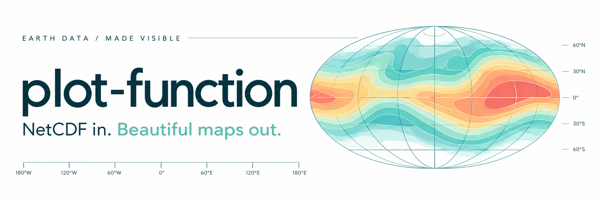
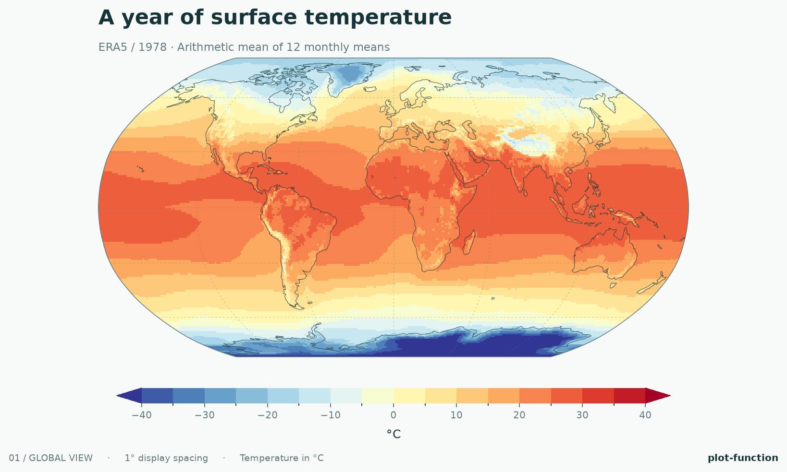
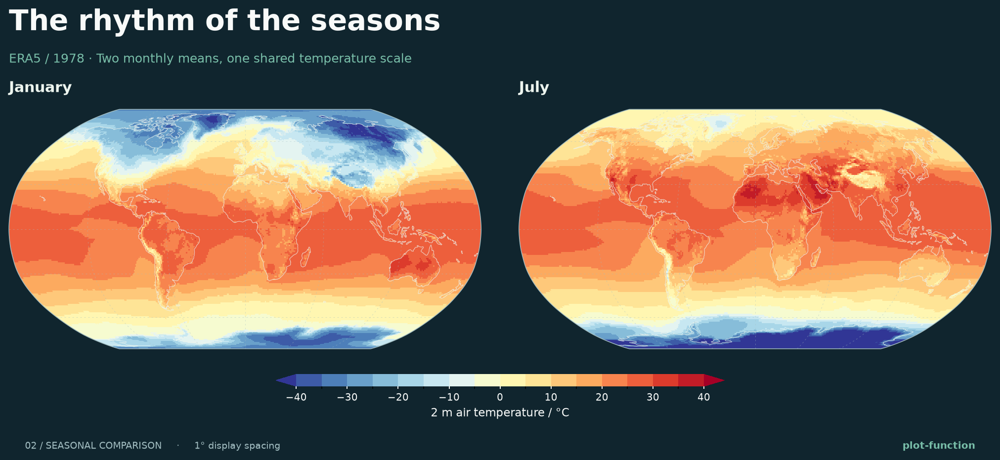
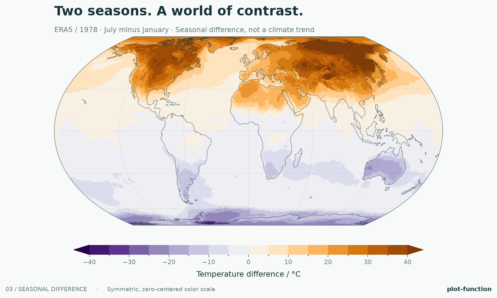
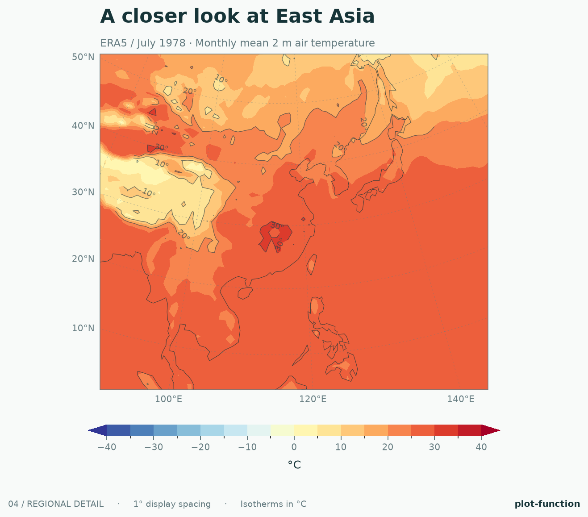

<p align="center"></p>



<p align="center"><a href="README.md">English</a> · <a href="README.zh-CN.md">简体中文</a> · <b>日本語</b></p>
<p align="center">
  <a href="https://github.com/GISWLH/plot-function/actions/workflows/tests.yml"></a>
  
  <a href="LICENSE"></a>
</p>

**NetCDF ファイルから、数行のコードで地図を作成。** `plot-function` は座標処理、地図投影、カラーバー、画像出力を、小さな Python API と CLI にまとめたツールです。従来の **xarray → Cartopy → Matplotlib** という構成を維持し、生成した図も自由に編集できます。

新しいワークフローでは Shapefile、GeoTIFF、Salem は不要です。海岸線は必要に応じて Cartopy の Natural Earth キャッシュから取得します。`coastlines=False` を指定すれば、完全にオフラインで描画できます。

[クイックスタート](#クイックスタート) · [ギャラリー](#ギャラリー) · [自分のデータを使う](#自分のデータを使う) · [コマンドライン](#コマンドライン) · [API リファレンス](docs/API.md)

## クイックスタート

**Python 3.10 以降**が必要です。以下はリポジトリからのインストール手順であり、PyPI での公開を前提としていません。

```bash
git clone https://github.com/GISWLH/plot-function.git
cd plot-function
python -m venv .venv
source .venv/bin/activate  # Windows PowerShell: .venv\Scripts\Activate.ps1
python -m pip install -e .
```

同梱の NetCDF ファイルから、最初の月の気温を描画します。

```python
from plot_function import plot_map

result = plot_map(
    "data/ERA5temp_1978_monthly.nc",
    variable="t2m",
    isel={"time": 0},
    offset=-273.15, units="°C",  # このファイルの気温の単位は K です。
    cmap="RdYlBu_r",
    title="January 1978 · 2 m air temperature",
    output="january.png",
)
```

海岸線の初回利用時には Natural Earth のデータをダウンロードする場合があります。これを避けるには `coastlines=False` を追加してください。Notebook では `result.figure` を表示し、GUI のある Python セッションでは `matplotlib.pyplot.show()` を呼び出します。日本語のタイトルを使う場合は、日本語対応の Matplotlib フォントを設定してください。

同梱の気候データを使わずに、軽量なオフラインの例も実行できます。

```bash
python examples/quickstart.py
```

このスクリプトは、**合成データ**と明記した NetCDF ファイルと PNG を `examples/output/` に生成します。コア依存関係だけで動作します。

## ギャラリー

以下の 4 枚はすべて、リポジトリに含まれる **1978 年 ERA5 の月平均・地上 2 m 気温 NetCDF ファイル**から、[`examples/gallery.py`](examples/gallery.py) で生成しています。別途 Shapefile やラスターファイルを用意する必要はありません。

### 01 · 全球を俯瞰する

Robinson 図法、控えめな経緯線、段階的な配色、水平カラーバーで空間分布を示します。



### 02 · 共通の尺度で季節を比較する

1 月と 7 月に同じカラースケールを使用し、比較しやすくしています。ダークテーマはプレゼンテーションにも適しています。



### 03 · 季節による差を見る

Equal Earth 図法と、ゼロを中心とする対称なカラースケールで、**7 月から 1 月を引いた気温差**を表示します。同じ年の季節差であり、長期的な気候トレンドや平年値からの偏差ではありません。



### 04 · 地域を詳しく見る

Lambert 正角円錐図法による東アジアの地図に、ラベル付きの等温線を重ねています。同じ NetCDF ファイルから全球図も地域図も作成できます。

<p align="center"></p>

ギャラリーを再生成するには：

```bash
python examples/gallery.py
# オフライン版。リポジトリ内の画像を上書きせず、別の場所へ保存します。
python examples/gallery.py --no-coastlines --output examples/output/gallery
```

**計算方法：** Kelvin から 273.15 を引いて摂氏に変換しています。年間の図は 12 個の月平均値を等しく重み付けした算術平均であり、各月の日数で重み付けした年平均ではありません。表示には緯度・経度とも 4 点ごとに 1 点を使用し、1° 間隔としています。元データは変更しません。海岸線は Natural Earth 110m です。[データと画像について](docs/assets/README.md)も参照してください。

## 自分のデータを使う

まず変数名、次元、単位を確認します。

```bash
plot-function inspect your-data.nc
```

```python
from plot_function import open_field, plot_map

# 変数名、次元名、鉛直レベルはファイルに合わせて変更します。
field = open_field(
    "your-data.nc", variable="temperature",
    isel={"time": 0}, sel={"level": 850},
)
result = plot_map(field, title="Temperature at 850 hPa", output="map.png")
```

同梱データの時間平均を地域図として描画する例です。

```python
result = plot_map(
    "data/ERA5temp_1978_monthly.nc", variable="t2m",
    reduce="time", statistic="mean",
    offset=-273.15, units="°C",
    projection="platecarree", extent=[90, 145, 5, 55],
    cmap="RdYlBu_r", title="East Asia · 1978 monthly-mean average",
)
result.save("figures/east-asia.pdf")
```

| 目的 | オプション |
| :--- | :--- |
| 位置 / 座標値で選ぶ | `isel={"time": 0}` / `sel={"level": 850}` |
| 追加の次元を集約する | `reduce="time"`, `statistic="mean"` |
| 複数の次元を集約する | `reduce=["time", "member"]` |
| 独自の緯度・経度名を指定する | `latitude="nav_lat", longitude="nav_lon"` |
| 値を明示的に変換する | `scale=1, offset=-273.15, units="°C"` |
| 地域を指定する | `extent=[西端, 東端, 南端, 北端]`、単位は度 |
| 複数の図を同じ尺度で比べる | 共通の `levels` または `vmin` / `vmax` |
| 見た目を変える | `theme="dark"`, `cmap="viridis"`, `plotfunc="contourf"` |
| 既存のレイアウトへ組み込む | Cartopy の `ax=` を渡すと、その投影法を使用 |
| 保存する | `output="map.png"` または `result.save("map.svg")` |

投影法の名前は `robinson`、`platecarree`、`equalearth`、`mollweide` に対応しています。Cartopy の投影オブジェクトも渡せます。戻り値 `MapResult` の `.figure`、`.axes`、`.artist`、`.colorbar`、`.data` から、注釈や共通カラーバーの追加、解析を続けられます。バッチ処理では `plt.close(result.figure)` で図を閉じてください。

### 対応するデータ

- **直交する経緯度格子：** 緯度・経度はそれぞれ 1 次元の有限値で、異なる座標を 2 点以上含む必要があります。`lat`/`lon`、`latitude`/`longitude`、CF の `standard_name` や地理座標の `units` を認識します。
- **処理は明示的に指定：** 候補となる変数が複数ある場合は `variable=` を指定します。値が複数ある非空間次元は選択または集約が必要です。集約は重み付けせず、欠損値を除外します。`mean`、`median`、`min`、`max`、`sum`、`std` を利用できます。
- **座標の正規化：** 緯度を並べ替え、経度を `[-180, 180)` に変換して整列します。全球格子の重複した 0°/360° 端点は除去し、それ以外の重複はエラーにします。
- **欠損値：** xarray が NetCDF の欠損値をデコードし、有限でない値をマスクします。有効な値がない場合は、原因を示すエラーを返します。
- **事前処理が必要なもの：** 曲線格子、非構造格子、メートル単位の投影 x/y 格子、日付変更線をまたぐ地域格子や範囲。元の格子の再投影や、単位・鉛直レベル・時間重み・面積重みの推定は行いません。
- **メモリ：** 選択・集約後の 2 次元データをメモリに読み込み、ファイルを閉じます。大規模な処理では xarray で前処理した `DataArray` を渡してください。

## コマンドライン

```bash
plot-function plot data/ERA5temp_1978_monthly.nc \
  --variable t2m --isel '{"time": 0}' \
  --offset -273.15 --units '°C' --cmap RdYlBu_r \
  --title 'January 1978' --output january.png

# GUI 不要・オフラインで月平均値を集約した地域図を作成：
plot-function plot data/ERA5temp_1978_monthly.nc \
  --variable t2m --reduce time --projection platecarree \
  --extent 90 145 5 55 --no-coastlines --output regional.png
```

`python -m plot_function` は `plot-function` と同じように使えます。全オプションは `plot-function plot --help` で確認できます。CLI は Matplotlib の Agg バックエンドを使うため、デスクトップ環境は不要です。選択条件には JSON オブジェクトを使用し、シェルに合わせて引用符で囲んでください。

## 既存の Notebook との互換性

```python
from utils import plot              # 従来のインポートも利用できます。
from plot_function import legacy   # 新パッケージ内の同じヘルパー群。
```

従来の地図、ハッチング、地域図、昇温シナリオのパネル描画を維持しています。海岸線へのキーワード引数の転送、ハッチングの反転と戻り値、地域範囲、凡例、カラーバー設定、プロファイルのラベルなどを修正しました。[移行ガイド](docs/MIGRATION.md)も参照してください。

従来の Notebook 用ツールはオプションとしてインストールできます。

```bash
python -m pip install -e '.[notebook,legacy]'
jupyter lab
```

[`plotbook.ipynb`](plotbook.ipynb) は、ラスターや Shapefile の例を含む従来のリファレンスです。中国の気温の節では同梱されていない `data/tp/tmp_2022.nc` を参照するため、そのまま全セルを実行することはできません。従来の中国境界ヘルパーはリポジトリの `data/` ファイル、または明示した Shapefile パスを必要とします。大きなサンプルデータは Python wheel に含めていません。新規利用には、上記の NetCDF の例を推奨します。

## 開発・貢献

```bash
python -m pip install -e '.[dev]'
pytest
ruff check plot_function utils tests examples
python examples/quickstart.py
python -m build
```

テストは NetCDF の選択、座標と単位の処理、ネットワークを使わない描画、CLI、従来 API の回帰不具合を対象としています。GitHub Actions は Python 3.10 と 3.12 でテストする構成です。貢献方法は [CONTRIBUTING.md](CONTRIBUTING.md) をご覧ください。

## 謝辞・ライセンス

作者は **Longhao Wang** です。[xarray](https://docs.xarray.dev/)、[Cartopy](https://scitools.org.uk/cartopy/docs/latest/)、[Matplotlib](https://matplotlib.org/)、[mplotutils](https://github.com/mathause/mplotutils) を利用しています。ソフトウェアのライセンスは [MIT](LICENSE) です。データの出典、Natural Earth のクレジット、装飾用画像と実データの図の区別については[素材の説明](docs/assets/README.md)を参照してください。
