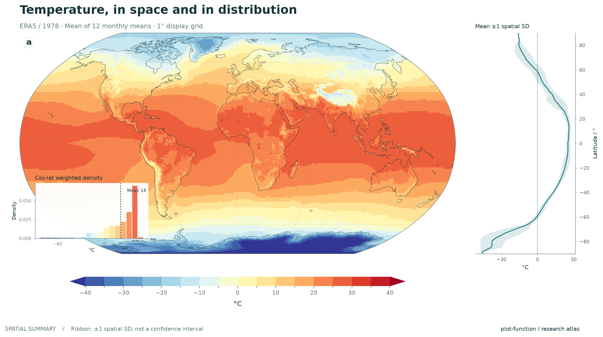
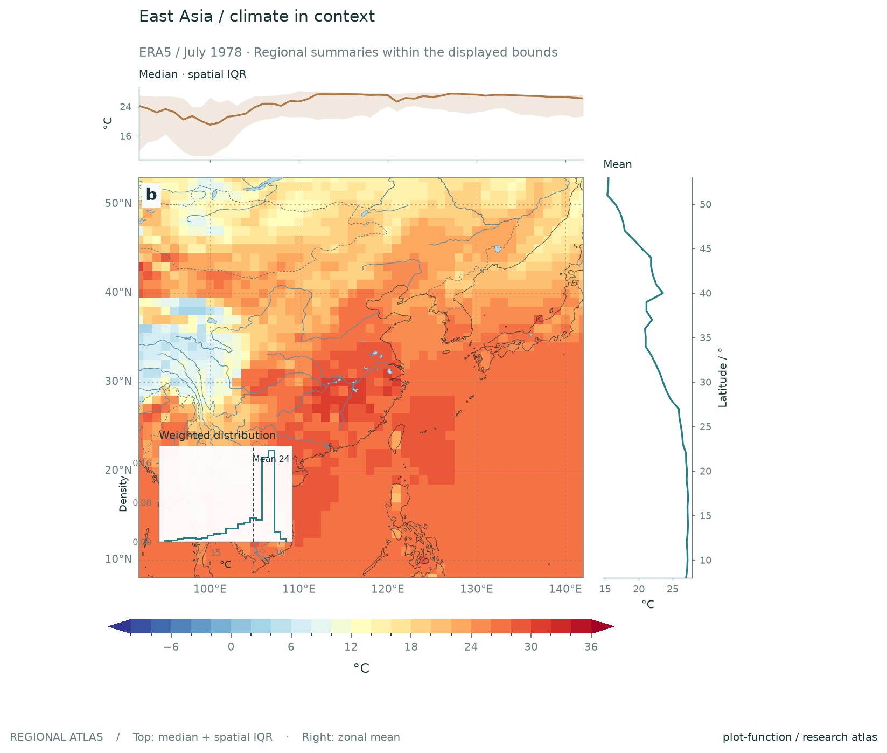
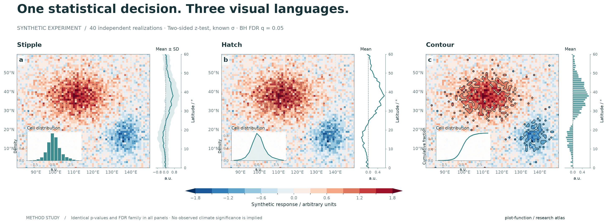

<p align="center">
  
</p>


<p align="center">
  <b>English</b> · <a href="README.zh-CN.md">简体中文</a> · <a href="README.ja.md">日本語</a>
</p>
<p align="center">
  <a href="https://github.com/GISWLH/plot-function/actions/workflows/tests.yml"></a>
  
  <a href="LICENSE"></a>
</p>

**Make a map from a NetCDF file in a few lines.** `plot-function` brings coordinate handling, geographic projections, colorbars, and export into a small Python API and command-line tool. It keeps the original **xarray → Cartopy → Matplotlib** approach, with full access to the resulting figure.

No shapefile, GeoTIFF, or Salem installation is needed for the new workflow. Optional coastlines come from Cartopy's Natural Earth cache; set `coastlines=False` for completely offline plotting.

[Quick start](#quick-start) · [Gallery](#gallery) · [Your own data](#your-own-data) · [CLI](#command-line) · [API reference](docs/API.md)

## Quick start

Requires Python **3.10+**. Install from this repository; the commands below do not assume a PyPI release.

```bash
git clone https://github.com/GISWLH/plot-function.git
cd plot-function
python -m venv .venv
source .venv/bin/activate  # Windows PowerShell: .venv\Scripts\Activate.ps1
python -m pip install -e .
```

Use the bundled NetCDF file to plot the first monthly temperature field:

```python
from plot_function import plot_map

result = plot_map(
    "data/ERA5temp_1978_monthly.nc",
    variable="t2m",
    isel={"time": 0},
    offset=-273.15, units="°C",  # This file stores temperature in Kelvin.
    cmap="RdYlBu_r",
    title="January 1978 · 2 m air temperature",
    output="january.png",
)
```

First use of coastlines may download Natural Earth data. Add `coastlines=False` to avoid that download. In a notebook, display `result.figure`; in a Python GUI session, call `matplotlib.pyplot.show()`.

Want a tiny example without external downloads or the bundled climate dataset?

```bash
python examples/quickstart.py
```

This creates a clearly labeled **synthetic** NetCDF field and a PNG in `examples/output/`, using only the core dependencies.

## Research figures: statistics, context, and significance

Build a complete composition with reusable option objects. The new layers work with the same NetCDF inputs and editable Matplotlib results.

```python
from plot_function import plot_map, Profile, Distribution, MapFeatures

result = plot_map(
    "data/ERA5temp_1978_monthly.nc", "t2m",
    isel={"time": 6}, offset=-273.15, units="°C",
    projection="platecarree", extent=[92, 142, 8, 53], cmap="RdYlBu_r",
    profiles=[Profile(position="right", style="band"),
              Profile(position="top", style="line", weights="coslat")],
    distribution=Distribution(style="bars", weights="coslat", color="map"),
    features=MapFeatures(rivers=True, lakes=True, borders=True, resolution="50m"),
    title="East Asia · July 1978", figsize=(12, 9),
    output="research-figure.png",
)
```

| Layer | Styles and controls |
| :--- | :--- |
| Marginal profiles | Right/top; `line`, `band`, `bars`; mean or median; spatial SD or IQR; reference lines |
| Distribution inset | Bottom-left by default; `bars`, `step`, `line`, `ecdf`; custom bins and placement; mean marker |
| Weighting | Equal cells, cosine latitude, or explicitly aligned cell weights |
| Significance | `stipple`, `hatch`, `contour`; supplied p-values or boolean masks; optional BH FDR correction |
| Geographic detail | Rivers, lakes, borders, land/ocean backgrounds; 110m, 50m, or 10m Natural Earth layers |
| Composition | Panel labels, shared color scales, editable axes, PNG/PDF/SVG export |



<p align="center"></p>

**Significance is an explicit statistical layer.** Supply p-values from a test appropriate to your data; the plotting library does not infer significance from map colors or sample size.

```python
from plot_function import Significance

# p_values must be a 2D DataArray on the same normalized grid as the map.
# Or pass a NetCDF path with variable=, sel= and/or isel=.
layer = result.add_significance(
    Significance(p_values, style="stipple", alpha=0.05, correction="fdr_bh")
)
print(layer.statistics.attrs)  # Tested cells, significant cells, and critical p-value.
```

The comparison below uses a **seeded synthetic Gaussian experiment**, not the ERA5 observations. Each panel uses exactly the same p-values and FDR decision; only the display style changes.



```bash
python examples/journal_gallery.py
# Entirely offline: omits coastlines and all downloaded geographic features.
python examples/journal_gallery.py --offline --output examples/output/journal

plot-function plot data/ERA5temp_1978_monthly.nc --variable t2m \
  --isel '{"time": 6}' --profile right --profile-style band \
  --distribution line --coslat --no-coastlines --output summary.png
```

Statistics are computed over finite grid-cell centers inside `extent`, or the full field when no extent is supplied. SD/IQR bands describe **spatial variability, not confidence intervals**. Cosine latitude approximates cell-area weights only on regular geographic grids; provide actual cell areas for irregular grids. Profiles have geographic coordinate scales; use Plate Carrée for direct alignment with map axes, since curved projections have different geometry. A frequency `line` is a histogram polygon, not a kernel density estimate. Features may require an initial download even when `coastlines=False`.

The [research-figure guide](docs/RESEARCH_FIGURES.md) documents all options, FDR assumptions, inset placement, returned statistics, and custom layouts.

## Gallery

All four figures below are generated by [`examples/gallery.py`](examples/gallery.py) from the repository's **1978 ERA5 monthly 2 m air temperature NetCDF file**. No external shapefile or raster input is needed.

### 01 · A global overview

Robinson projection, restrained gridlines, discrete temperature intervals, and a readable horizontal colorbar.


### 02 · Two seasons, one scale

January and July share the same color limits, making a side-by-side comparison meaningful. A dark theme provides an alternative for presentations.


### 03 · The seasonal difference

An Equal Earth view with a symmetric, zero-centered color scale for **July minus January**. This is a seasonal difference within one year, not a climate trend or a climatological anomaly.


### 04 · Regional detail

A Lambert conformal view of East Asia with labeled isotherms. The same NetCDF field supports both global and regional figures.

<p align="center"></p>

Rebuild the gallery:

```bash
python examples/gallery.py
# Offline alternative; preserves the checked-in gallery:
python examples/gallery.py --no-coastlines --output examples/output/gallery
```

**How the demo is computed:** Kelvin is converted to Celsius by subtracting 273.15. The annual view is an equally weighted mean of 12 monthly means, not a day-weighted annual mean. Every fourth latitude/longitude point is used for 1° display spacing; the original data are unchanged. Coastlines are Natural Earth 110m. See [data and artwork notes](docs/assets/README.md).

## Your own data

Start by inspecting variable names, dimensions, and units:

```bash
plot-function inspect your-data.nc
```

```python
from plot_function import open_field, plot_map

# Explicitly choose a time and a vertical level when present.
# Adapt these dimension names and values to your file.
field = open_field(
    "your-data.nc", variable="temperature",
    isel={"time": 0}, sel={"level": 850},
)
result = plot_map(field, title="Temperature at 850 hPa", output="map.png")
```

For the bundled dataset, a temporal mean needs just one extra argument:

```python
result = plot_map(
    "data/ERA5temp_1978_monthly.nc", variable="t2m",
    reduce="time", statistic="mean",
    offset=-273.15, units="°C",
    projection="platecarree", extent=[90, 145, 5, 55],
    cmap="RdYlBu_r", title="East Asia · 1978 monthly-mean average",
)
result.save("figures/east-asia.pdf")
```

| Need | Option |
| :--- | :--- |
| Select by position / coordinate label | `isel={"time": 0}` / `sel={"level": 850}` |
| Aggregate an extra dimension | `reduce="time"`, `statistic="mean"` |
| Aggregate several dimensions | `reduce=["time", "member"]` |
| Use custom geographic coordinate names | `latitude="nav_lat", longitude="nav_lon"` |
| Convert values explicitly | `scale=1, offset=-273.15, units="°C"` |
| Focus on a region | `extent=[west, east, south, north]` |
| Compare panels consistently | Set the same `levels` or `vmin` / `vmax` |
| Change appearance | `theme="dark"`, `cmap="viridis"`, `plotfunc="contourf"` |
| Use your existing layout | Pass a Cartopy `ax=`; its projection takes precedence |
| Export | `output="map.png"` or `result.save("map.svg")` |

Supported projection names are `robinson`, `platecarree`, `equalearth`, and `mollweide`. A Cartopy projection object also works. The returned `MapResult` exposes `.figure`, `.axes`, `.artist`, `.colorbar`, and `.data` for annotations, shared colorbars, and further analysis. Call `plt.close(result.figure)` in batch scripts.

### Data contract

- **Rectilinear geographic grids:** latitude and longitude must each be one-dimensional, finite, and contain at least two distinct values. CF `standard_name` / geographic `units` and common `lat`/`lon` or `latitude`/`longitude` names are recognized.
- **Explicit scientific choices:** multiple fields require `variable=`; nonspatial dimensions with more than one value require selection or reduction. Reductions are unweighted and skip missing values. Supported statistics: `mean`, `median`, `min`, `max`, `sum`, `std`.
- **Coordinate normalization:** latitude is sorted, longitude is wrapped to `[-180, 180)` and sorted; a redundant global 0°/360° endpoint is removed. Other duplicates are rejected.
- **Missing values:** xarray decodes NetCDF fill values; nonfinite values are masked. An entirely missing field produces an actionable error.
- **Bounded scope:** curvilinear grids, unstructured meshes, projected x/y grids in metres, and antimeridian-crossing regional grids/extents need preprocessing. The API does not reproject source grids or infer units, vertical levels, time weights, or area weights.
- **Memory:** the selected/reduced 2D field is loaded before the file is closed. For large workflows, preprocess with xarray and pass a prepared `DataArray`.

## Command line

```bash
plot-function plot data/ERA5temp_1978_monthly.nc \
  --variable t2m --isel '{"time": 0}' \
  --offset -273.15 --units '°C' --cmap RdYlBu_r \
  --title 'January 1978' --output january.png

# Headless, offline, regional monthly-mean average:
plot-function plot data/ERA5temp_1978_monthly.nc \
  --variable t2m --reduce time --projection platecarree \
  --extent 90 145 5 55 --no-coastlines --output regional.png
```

`python -m plot_function` is equivalent to `plot-function`. Use `plot-function plot --help` for all options. CLI rendering uses Matplotlib's headless Agg backend. Selection arguments are JSON objects; quote them for your shell.

## Existing notebooks still work

```python
from utils import plot              # Original import remains available.
from plot_function import legacy   # The same helpers in the new package.
```

The low-level map, hatching, regional, and warming-panel helpers are retained. Bugs in coastline keyword forwarding, hatch inversion and return values, regional extents, legends, colorbar overrides, and profile labeling have been corrected. See [migration notes](docs/MIGRATION.md).

Optional tools for the historical notebook are separate from the core install:

```bash
python -m pip install -e '.[notebook,legacy]'
jupyter lab
```

[`plotbook.ipynb`](plotbook.ipynb) is the historical reference, including raster/shapefile examples. Its China-temperature section references the unbundled `data/tp/tmp_2022.nc`, so it cannot run end-to-end as distributed. Legacy China boundary helpers need the repository's `data/` files (or explicit shapefile paths); those large datasets are not included in the Python wheel. New users should start with the NetCDF examples above.

## Development

```bash
python -m pip install -e '.[dev]'
pytest
ruff check plot_function utils tests examples
python examples/quickstart.py
python -m build
```

Tests cover NetCDF selection, coordinate and unit handling, rendering without network downloads, the CLI, and legacy regressions. GitHub Actions runs tests on Python 3.10 and 3.12. Contributions are welcome: see [CONTRIBUTING.md](CONTRIBUTING.md).

## Credits & license

Created by **Longhao Wang**. Built on [xarray](https://docs.xarray.dev/), [Cartopy](https://scitools.org.uk/cartopy/docs/latest/), [Matplotlib](https://matplotlib.org/), and [mplotutils](https://github.com/mathause/mplotutils). Software is licensed under [MIT](LICENSE). Dataset provenance, Natural Earth attribution, and the distinction between decorative artwork and computed plots are documented [here](docs/assets/README.md).
