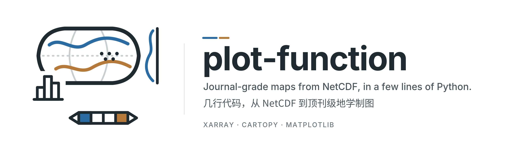
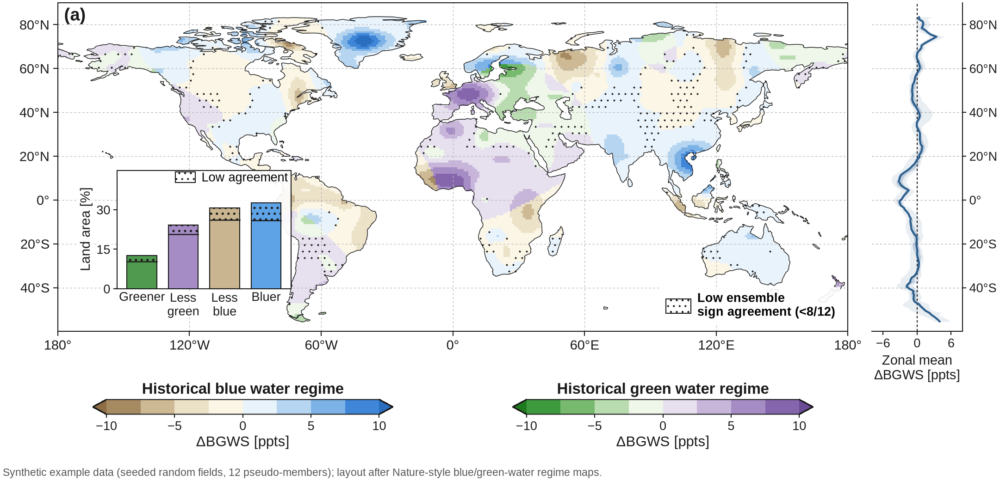
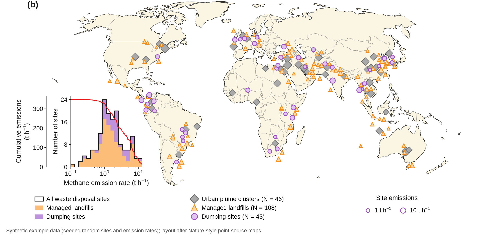
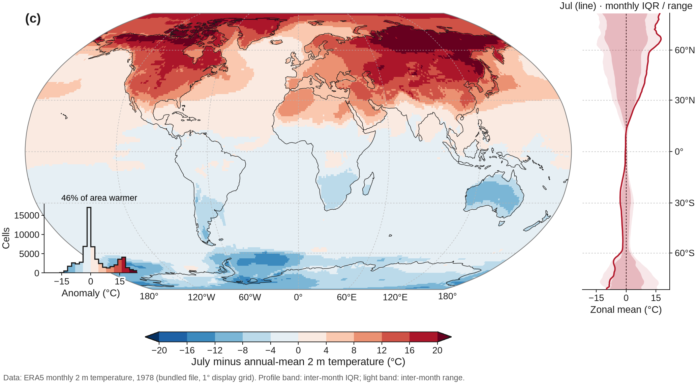
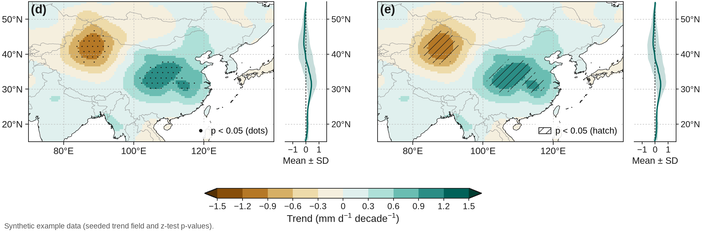
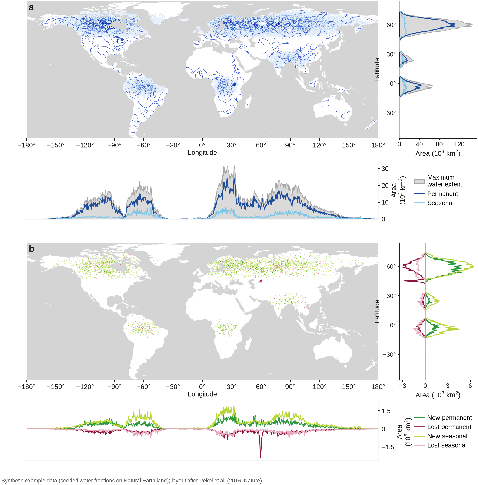
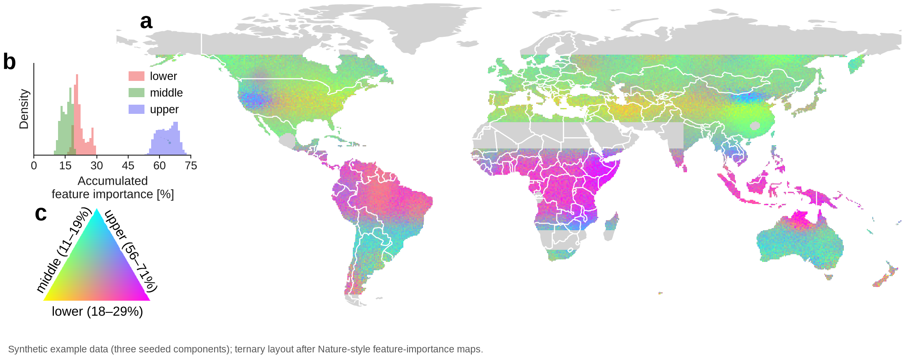

<p align="center">
  
</p>

<p align="center">
  <a href="https://github.com/GISWLH/plot-function/actions/workflows/tests.yml"></a>
  
  <a href="LICENSE"></a>
  <a href="https://github.com/GISWLH/plot-function/stargazers"></a>
  <a href="https://github.com/GISWLH/plot-function/network/members"></a>
  <a href="https://github.com/GISWLH/plot-function/commits/main"></a>
  
</p>

<p align="center">
  <b>English</b> · <a href="#中文简介">中文简介</a> · <a href="README.zh-CN.md">简体中文完整文档</a> · <a href="README.ja.md">日本語</a>
  <br>
  <a href="#gallery">Gallery</a> · <a href="#quick-start">Quick start</a> · <a href="#journal-toolkit">Journal toolkit</a> · <a href="docs/API.md">API</a> · <a href="docs/RESEARCH_FIGURES.md">Research-figure guide</a> · <a href="#citation">Cite</a>
</p>

**plot-function** turns NetCDF / xarray fields into figures that look like they came out of *Nature*, *Science* or *Nature Geoscience*:
discrete diverging colour scales with triangle ends, stippling for low ensemble agreement, a lower-left statistics inset,
a right-hand zonal-mean profile that is **aligned with the map latitudes on any projection**, clean `40°N` ticks, Arial 7–9 pt typography and 600-dpi export — in a few lines of Python, with every Matplotlib object still yours to edit.

> ⭐ If it saves you an afternoon of fiddling with Cartopy, please **star the repo** — it helps other geoscientists find it.

## Gallery

| | |
| :---: | :---: |
| <a href="docs/gallery/fig1_regimes.png"></a><br><sub><b>Regime map</b> · two BrBG-style scales · stippling · hatched inset bars · ensemble zonal profile</sub> | <a href="docs/gallery/fig2_sites.png"></a><br><sub><b>Site map</b> · cream land · sized markers · log histogram + cumulative curve · legends below</sub> |
| <a href="docs/gallery/fig3_era5_profile.png"></a><br><sub><b>Robinson + aligned profile</b> · real ERA5 1978 · inter-month IQR and range bands</sub> | <a href="docs/gallery/fig4_regional_significance.png"></a><br><sub><b>Regional panels</b> · one shared scale · stippling vs hatching · per-panel profiles</sub> |

| <a href="docs/gallery/fig5_water_marginals.png"></a><br><sub><b>Map + latitude & longitude marginals</b> · grey no-data · area totals per row/column · gain/loss panel (Pekel-style)</sub> | <a href="docs/gallery/fig6_ternary.png"></a><br><sub><b>Ternary (3-component) RGB map</b> · density inset · triangle colour key with rotated edge labels</sub> |
| <a href="docs/assets/journal-global.png"></a><br><sub><b>Two-row Robinson</b> · real ERA5 1978 · land / ocean zonal profiles · area-per-class histograms</sub> | <a href="docs/assets/journal-significance.png"></a><br><sub><b>Significance, three ways</b> · stippling / hatching / FDR-vs-raw outlines · Benjamini–Hochberg diagnostic</sub> |

<sub>Figures 1, 2, 4, 5, 6 and the significance figure use <b>synthetic example data</b> (seeded, labelled in each figure); figure 3 and the Robinson pair use the bundled ERA5 1978 monthly 2 m temperature file. Layouts 5 and 6 follow published Nature-style figures (Pekel et al. 2016; ternary feature-importance maps) — only the layout, not their data. Reproduce everything with <code>python examples/journal_figures.py</code> and <code>python examples/journal_gallery.py</code>.</sub>

## Features

- **One-call maps from NetCDF** — `plot_map("file.nc", "t2m", isel={"time": 0})` handles variable/dimension selection, coordinate normalisation, projection, colourbar and export.
- **Journal typography** — `journal_style()` applies Arial/Helvetica (with Liberation/Nimbus fallbacks), 7–9 pt text, 0.5 pt lines, editable text in PDF/SVG; `figsize("single" | "double")` gives 89/183 mm column widths.
- **Discrete colour scales** — `discrete_cmap()` returns a `(cmap, norm)` pair whose extend triangles take the darkest colours, exactly like printed atlases.
- **Significance & agreement** — `add_stippling()` (staggered dot lattice) and `add_hatching()` from a mask, or `Significance(p_values, correction="fdr_bh")` in `plot_map`.
- **Lower-left insets** — `add_inset_bars()` with hatched low-agreement fractions; `add_inset_histogram()` with stacked groups, a total outline, log bins and a cumulative curve on an offset twin axis. Labels get a white halo so they stay legible over the map.
- **Aligned marginal profiles** — `add_latitude_profile()` / `add_longitude_profile()` push latitudes through the map projection, so 40°N on the profile is level with 40°N on Robinson or Equal Earth maps; IQR/ensemble bands, min–max envelopes or individual members.
- **Cartographic polish** — `geo_ticks()` (degree labels, dashed light graticule), `add_land()` (cream land, thin grey borders), `add_size_legend()`, `add_panel_label()`, `save_figure(dpi=600)`.
- **Batteries included** — CLI (`plot-function plot …`), offline tests, CI, and the original notebook helpers (`from utils import plot`) kept for backwards compatibility.

## Quick start

```bash
git clone https://github.com/GISWLH/plot-function.git
cd plot-function
python -m pip install -e .          # Python 3.10+, not yet on PyPI
python examples/journal_quickstart.py
```

**A complete map from the bundled NetCDF file:**

```python
import numpy as np
from plot_function import plot_map, Profile, Distribution

result = plot_map(
    "data/ERA5temp_1978_monthly.nc", "t2m",
    reduce="time", offset=-273.15, units="°C",
    cmap="RdYlBu_r", levels=np.arange(-40, 41, 5),
    title="Annual-mean 2 m air temperature",
    profiles=Profile(style="band", reference=0, label="Zonal mean ± 1 s.d."),
    distribution=Distribution(style="bars", weights="coslat", color="map"),
    panel_label="a",
    output="annual_mean.png", dpi=600,
)
```

## Journal toolkit

`plot_function.journal` works with *any* Cartopy axes, so you can build fully custom multi-panel figures:

```python
import numpy as np, matplotlib.pyplot as plt, cartopy.crs as ccrs
import plot_function.journal as pj

lon, lat = np.arange(-179.5, 180, 1.0), np.arange(-59.5, 90, 1.0)
field = (8 * np.sin(np.deg2rad(2 * lon))[None, :] * np.cos(np.deg2rad(lat))[:, None]
         + 4 * np.sin(np.deg2rad(3 * lat))[:, None])          # example data
low_agreement = np.abs(field) < 1.5

with pj.journal_style():
    fig = plt.figure(figsize=pj.figsize("double", 0.45))
    ax = fig.add_axes([0.06, 0.24, 0.78, 0.72], projection=ccrs.PlateCarree())
    ax.set_extent([-180, 180, -60, 90], crs=ccrs.PlateCarree())
    cmap, norm = pj.discrete_cmap("BrBG", np.arange(-10, 10.1, 2.5), extend="both")
    mesh = ax.pcolormesh(lon, lat, field, cmap=cmap, norm=norm, transform=ccrs.PlateCarree())
    ax.coastlines(lw=0.3)
    pj.geo_ticks(ax, xticks=range(-180, 181, 60), yticks=range(-40, 81, 20))
    pj.add_stippling(ax, lon, lat, low_agreement, stride=3)
    pj.add_inset_bars(ax, ["Drier", "Wetter"], [42, 58], hatched=[9, 12],
                      colors=["#a6611a", "#018571"], ylabel="Area [%]")
    pj.add_latitude_profile(ax, lat, field.mean(1), lower=np.percentile(field, 25, 1),
                            upper=np.percentile(field, 75, 1), xlabel="Zonal mean")
    pj.add_colorbar(mesh, ax, title="Example regime", label="Δ [units]")
    pj.add_panel_label(ax, "a")
    pj.save_figure(fig, "my_figure.png", dpi=600)      # or formats=("png", "pdf")
```

| Helper | What it draws |
| :--- | :--- |
| `journal_style()`, `figsize()` | Temporary rcParams for 7–9 pt Arial-like figures; 89 / 120 / 183 mm widths |
| `discrete_cmap(cmap, levels, extend)` | One colour per interval, darkest colours on the triangles |
| `add_colorbar(mappable, ax, title=, label=)` | Slim bar, triangle ends, bold title above and label below |
| `geo_ticks(ax, xticks=, yticks=)` | `60°E` / `40°N` ticks, light dashed graticule |
| `add_stippling`, `add_hatching`, `hatch_patch` | Low-agreement / significance overlays and legend handles |
| `add_inset_bars(..., hatched=)` | Category bars with hatched uncertain fractions |
| `add_inset_histogram(groups, log=, cumulative=)` | Stacked histogram, total outline, cumulative twin axis |
| `add_latitude_profile`, `add_longitude_profile` | Projection-aligned marginal profiles with bands |
| `add_land`, `add_size_legend`, `add_panel_label`, `save_figure` | Cream land & borders, marker-size legend, **(a)** labels, 600 dpi |

More: the [API reference](docs/API.md), the [research-figure guide](docs/RESEARCH_FIGURES.md) (profiles, distributions, FDR significance in `plot_map`) and the [migration notes](docs/MIGRATION.md).

## Your own data & the CLI

```bash
plot-function inspect your-data.nc              # list variables, dims, units
plot-function plot data/ERA5temp_1978_monthly.nc --variable t2m --isel '{"time": 6}' \
  --offset -273.15 --units '°C' --profile right --distribution bars --output july.png
```

```python
from plot_function import open_field, plot_map
field = open_field("your-data.nc", variable="temperature", isel={"time": 0}, sel={"level": 850})
plot_map(field, projection="platecarree", extent=[90, 145, 5, 55], output="map.pdf")
```

`plot_map` returns a `MapResult` exposing `.figure`, `.axes`, `.artist`, `.colorbar`, `.data`, `.profiles` and `.distribution` for further editing. Rectilinear lat/lon grids are supported; see the [data contract](docs/API.md#data-contract) and [API reference](docs/API.md) for details. Existing notebooks keep working via `from utils import plot`.

## Development

```bash
python -m pip install -e '.[dev]'
pytest && ruff check plot_function utils tests examples
python examples/journal_figures.py --dpi 600 --pdf   # rebuild the gallery
```

## Links

- 👤 Author: **Longhao Wang** — [homepage](https://giswlh.github.io/) · [GitHub @GISWLH](https://github.com/GISWLH) · [Google Scholar](https://scholar.google.com/citations?user=ei3oenUAAAAJ) · [ORCID](https://orcid.org/0000-0002-4642-4701) · [Hugging Face](https://huggingface.co/LonghaoWang)
- 🌏 Related: [IPCC](https://github.com/GISWLH/IPCC) (IPCC-style climate visualisation) · [CAS-Canglong](https://github.com/GISWLH/CAS-Canglong) · [WeatherAI](https://github.com/GISWLH/WeatherAI) (weather AI model zoo) · [GeoAreaWeight](https://github.com/GISWLH/GeoAreaWeight) (area-weighted means) · [cartopy-robinson-lat-clip](https://github.com/GISWLH/cartopy-robinson-lat-clip)
- 🐛 [Issues & feature requests](https://github.com/GISWLH/plot-function/issues) · [Contributing](CONTRIBUTING.md) · [Changelog](CHANGELOG.md)

## Citation

If plot-function helped your paper, please cite it (GitHub's **“Cite this repository”** button reads [`CITATION.cff`](CITATION.cff)) and ⭐ star the project:

```bibtex
@software{wang_plot_function,
  author  = {Wang, Longhao},
  title   = {plot-function: journal-grade maps from NetCDF with xarray, Cartopy and Matplotlib},
  url     = {https://github.com/GISWLH/plot-function},
  version = {0.4.0},
  license = {MIT}
}
```

## Star history

<a href="https://star-history.com/#GISWLH/plot-function&Date">
  
</a>

## 中文简介

**plot-function** 让 NetCDF / xarray 数据几行代码就画出顶刊风格的地学地图：带三角端点的离散发散色标、低一致性打点（stippling）、左下角统计小图（分类柱状图 / 对数直方图 + 累积曲线）、右侧与地图纬度**严格对齐**的纬向平均剖面（任意投影，含 Robinson）、`40°N` 式坐标、Arial 7–9 pt 字体以及 600 dpi 导出。所有 Matplotlib 对象都可以继续修改。

- **一行出图**：`plot_map("file.nc", "t2m", isel={"time": 0})`，自动处理变量、维度、坐标、投影、色标与导出。
- **顶刊工具箱** `plot_function.journal`：`journal_style()` 字体规范、`discrete_cmap()` 离散色标、`add_stippling()` / `add_hatching()` 显著性、`add_inset_bars()` / `add_inset_histogram()` 左下角小图、`add_latitude_profile()` 右侧纬度剖面、`geo_ticks()` 经纬度刻度、`add_colorbar()` 色标、`save_figure()` 高分辨率导出。
- **快速开始**：`python -m pip install -e .` 后运行 `python examples/journal_quickstart.py`；完整画廊见 `python examples/journal_figures.py`。
- 示例图 1、2、4 与显著性示例使用**合成示例数据**（图中已注明），其余使用仓库自带的 ERA5 1978 月平均气温。

完整中文文档见 [README.zh-CN.md](README.zh-CN.md)。觉得有用的话欢迎点个 ⭐ Star，也欢迎在论文中引用！

## License

[MIT](LICENSE) © Longhao Wang. Dataset provenance and Natural Earth attribution: [docs/assets/README.md](docs/assets/README.md). Logo and banner are hand-authored SVG line drawings in [`docs/brand/`](docs/brand/).
